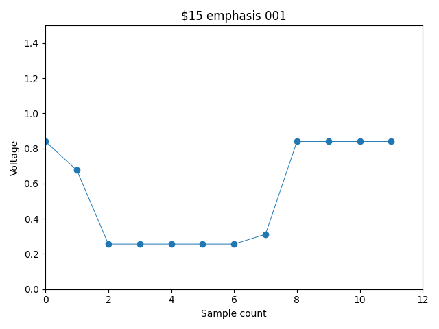

# Palette Generator

yet another NES palette generator, in Python



## Requirements

This script requires `numpy` for color decoding.
This script requires `matplotlib.pyplot` for previewing

## Usage
```
usage: palgen-persune.py [-h] [-o OUTPUT] [-e] [-v] [-d] [--brightness BRIGHTNESS] [--contrast CONTRAST] [--hue HUE] [--saturation SATURATION]
                         [--phase-skew PHASE_SKEW] [--white-ire WHITE_IRE]

yet another NES palette generator

options:
  -h, --help            show this help message and exit
  -o OUTPUT, --output OUTPUT
                        .pal file output
  -e, --emphasis        add emphasis entries
  -v, --verbose         look at waveforms
  -d, --debug           debug messages
  --brightness BRIGHTNESS
                        brightness, -1.0 to 1.0
  --contrast CONTRAST   contrast, 0.0 to 1.0
  --hue HUE             hue angle, in degrees
  --saturation SATURATION
                        saturation, -1.0 to 1.0
  --phase-skew PHASE_SKEW
                        differential phase distortion, in degrees
  --white-ire WHITE_IRE
                        differential phase distortion, in degrees

version 0.0.1
```

## License

This work is licensed under the MIT-0 license.
Copyright (C) Persune 2023.
