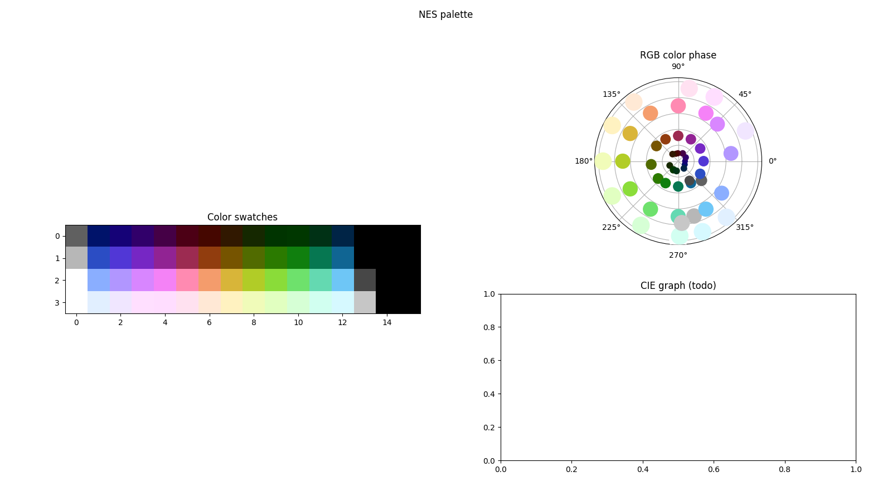
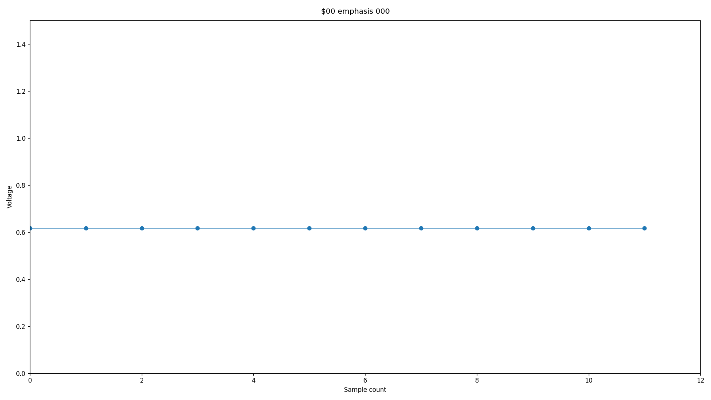
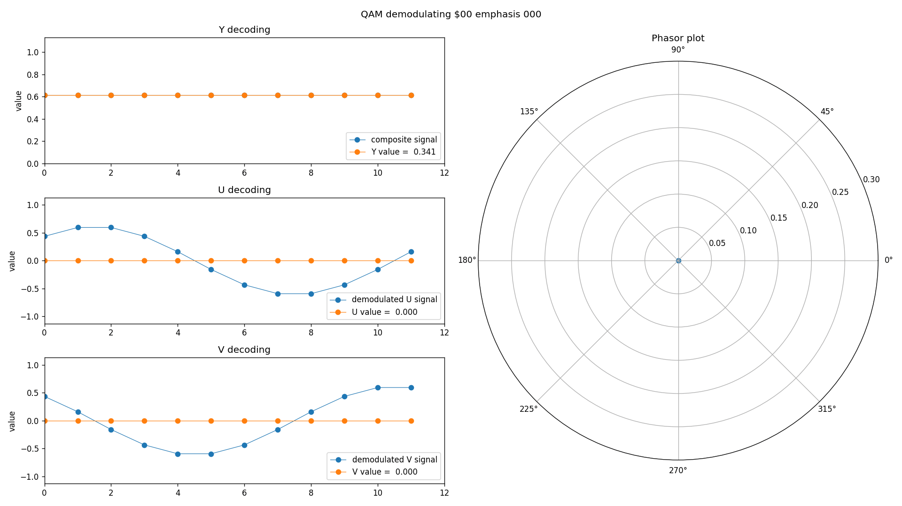

# Palette Generator

yet another NES palette generator, in Python




## Requirements

This script requires `numpy` for arrays and matricies used for color calculations.
This script requires `matplotlib` for graphs.

## Usage
```
usage: palgen-persune.py [-h] [-o OUTPUT] [-e] [-d] [-n] [-v] [-p] [--brightness BRIGHTNESS] [--contrast CONTRAST] [--hue HUE] [--saturation SATURATION]
                         [--phase-skew PHASE_SKEW] [--black-point BLACK_POINT] [--white-point WHITE_POINT]

yet another NES palette generator

options:
  -h, --help            show this help message and exit
  -o OUTPUT, --output OUTPUT
                        .pal file output
  -e, --emphasis        add emphasis entries
  -d, --debug           debug messages
  -n, --normalize       normalize white point and black point within range of voltages
  -v, --visualize-wave  render composite waveforms as .png in docs folder
  -p, --phase-QAM       render QAM demodulation as .png in docs folder
  --brightness BRIGHTNESS
                        brightness, -1.0 to 1.0, default = 0.0
  --contrast CONTRAST   contrast, 0.0 to 1.0, default = 0.0
  --hue HUE             hue angle delta, in degrees, default = 0.0
  --saturation SATURATION
                        saturation delta, -1.0 to 1.0, default = 0.0
  --phase-skew PHASE_SKEW
                        differential phase distortion, in degrees, default = 0.0
  --black-point BLACK_POINT
                        black point, in voltage units relative to blanking, default = 7.5/140.0
  --white-point WHITE_POINT
                        white point, in voltage units relative to blanking, default = 100.0/140.0

version 0.1.1
```

## License

This work is licensed under the MIT-0 license.
Copyright (C) Persune 2023.

## Credits

Special thanks to:
- _aitchFactor
- lidnariq
- NewRisingSun
- jekuthiel
This would have not been possible without their help!
